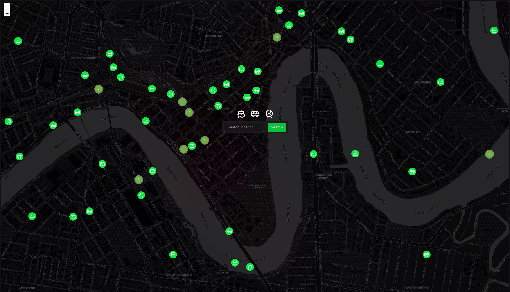

# Transport App

A real-time public transit tracking and route planning application built with SvelteKit and Express. Track live vehicle locations, plan multi-modal journeys, and visualize routes on an interactive map.

[](https://bne-transport.vercel.app/)

## Features

- 🚌 **Real-time Vehicle Tracking** - View live positions of buses and trains on the map
- 🗺️ **Route Planning** - Get multi-modal transit directions with walking segments
- 🔍 **Location Search** - Search for destinations using Mapbox geocoding
- ⏰ **Time-based Planning** - Plan trips for "leave now", specific departure, or arrival times
- 📍 **Geolocation Support** - Automatically detect your current location
- 🗺️ **Interactive Map** - Powered by Leaflet with clustering for vehicle markers
- 🌙 **Dark Mode UI** - Modern dark theme with smooth animations

## Tech Stack

### Frontend

- **SvelteKit** - Web framework with SSR and client-side routing
- **TypeScript** - Type-safe development
- **Tailwind CSS** - Utility-first styling
- **Leaflet** - Interactive map library with marker clustering
- **Lucide Svelte** - Icon components

### Backend

- **Express** - Node.js web framework
- **TypeScript** - Type-safe API development
- **Translink GTFS Realtime** - Real-time transit data parsing
- **Google Maps API** - Route planning and directions
- **Ubuntu VPS with reverse proxy** - Backend container hosting and request routing

## Project Structure

```
transport-app/
├── client/          # SvelteKit frontend application
├── server/          # Express backend API
├── shared/          # Shared TypeScript types
└── docker-compose.yml
```

## Getting Started

### Prerequisites

- Node.js 18+ and npm
- Google Maps API key (for route planning)
- GTFS Realtime feed URL (for live vehicle tracking)

### Installation

1. **Clone the repository**

   ```bash
   git clone <repository-url>
   cd transport-app
   ```

2. **Install dependencies**

   ```bash
   npm install
   ```

3. **Configure environment variables**

   Create `server/.env` from the example:

   ```bash
   cp server/.env.example server/.env
   ```

   Edit `server/.env` and add your API keys:

   ```env
   GOOGLE_MAPS_API_KEY=your_google_maps_api_key_here
   PORT=3000
   ```

4. **Start the development servers**

   Terminal 1 - Backend:

   ```bash
   npm run dev
   ```

   Terminal 2 - Frontend:

   ```bash
   cd client
   npm run dev
   ```

5. **Open your browser**

   Navigate to `http://localhost:5173`

## Building for Production

### Backend

```bash
npm run build
npm start
```

### Frontend

```bash
cd client
npm run build
npm run preview
```

## Docker Deployment

Build and run with Docker Compose:

```bash
docker-compose up --build
```

The server will be available on port 3000.

## API Endpoints

### `GET /vehicles`

Returns real-time vehicle locations from GTFS Realtime feed.

**Response:**

```json
[
 {
  "id": "vehicle-123",
  "latitude": -27.4698,
  "longitude": 153.0251,
  "route": "199",
  "vehicleType": "BUS",
  "bearing": 45
 }
]
```

### `GET /route`

Get transit directions between two points.

**Query Parameters:**

- `startLat`, `startLng` - Origin coordinates
- `endLat`, `endLng` - Destination coordinates
- `departureTime` (optional) - ISO 8601 datetime
- `arrivalTime` (optional) - ISO 8601 datetime

**Response:**

```json
{
  "routes": [
    {
      "legs": [...],
      "duration": "PT25M",
      "distance": 8.5
    }
  ]
}
```

## Scripts

### Root

- `npm run dev` - Start backend dev server
- `npm run build` - Build backend for production
- `npm run clean` - Clean build artifacts

### Client

- `npm run dev` - Start frontend dev server
- `npm run build` - Build frontend for production
- `npm run preview` - Preview production build
- `npm run lint` - Lint code
- `npm run format` - Format code with Prettier
- `npm test` - Run unit tests

### Server

- `npm run dev` - Start backend with hot reload
- `npm run build` - Compile TypeScript
- `npm start` - Start production server

## Contributing

Contributions are welcome! Please feel free to submit a Pull Request.

## License

This project is private and not licensed for public use.
